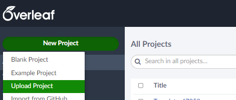
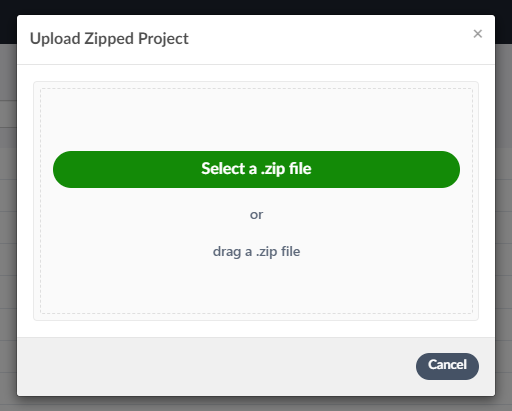

# 使用 overleaf 撰寫論文

[https://overleaf.com/](https://overleaf.com)

## 使用步驟

1. Click "New Project/Upload Project" 
1. Upload .zip file you [download](https://minhaskamal.github.io/DownGit/#/home?url=https://github.com/jerryhuangyu/NckuXRLabThesisTemplate/) from this repo 
1. Start working on thesis-param, contents folders
1. Compile and download PDF
